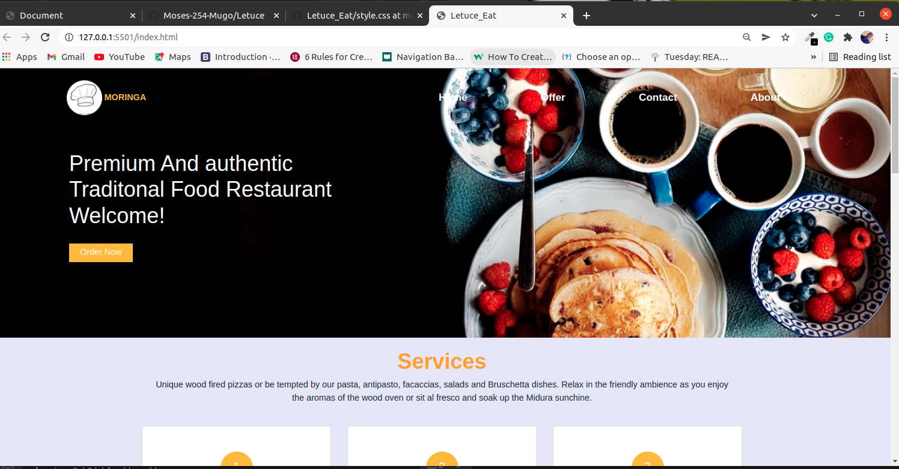
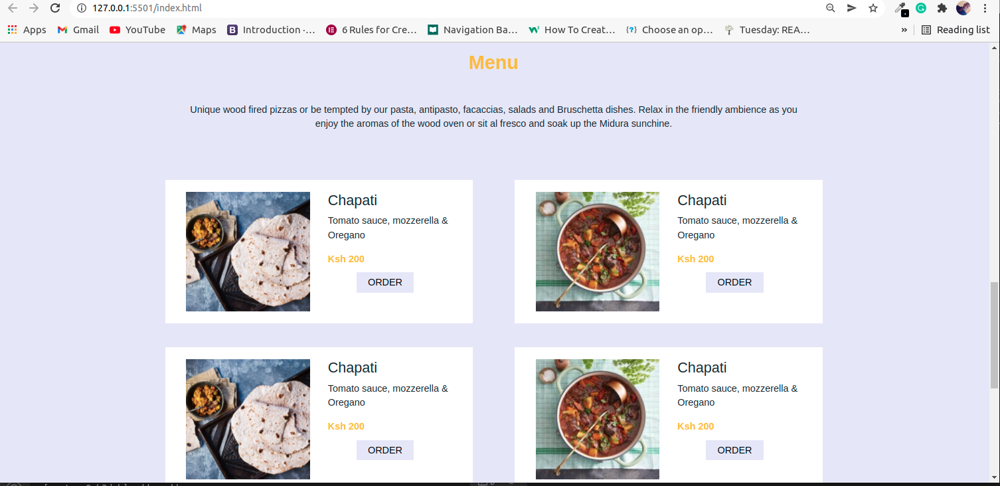
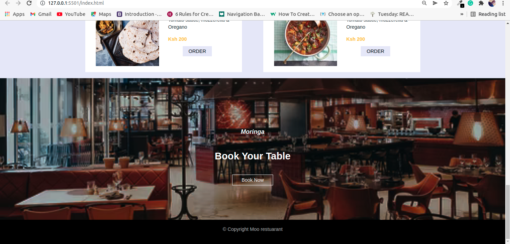

# Letuce Eat

## Contributors
* Fee free to comment, critique or even submit a pull request.

## Author
* Moses Kinyua

## Description
Simple landing page of Letuce Eat

## Screenshot

## Techonologies Used
* HTML
* Bootstrap
* CSS
* JavaScrpt

## Support and contact details
* If you have any issue, want to contribute to the code, have question? Contact me via

 * moseskinyua12@gmail.com

## License
* The project is open source and availble under the  [MIT License](LICENSE)
  